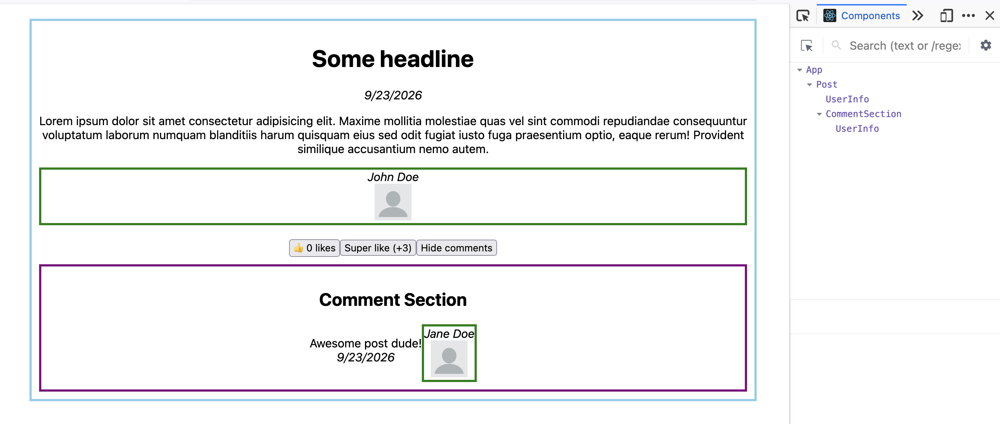

# Lecture 2 – Conditional rendering, event handlers and useState

## Video links
- [01 - Conditional Rendering & Basic Layout Solution](https://medieinstitutet.sharepoint.com/sites/FED25D/_layouts/15/stream.aspx?id=%2Fsites%2FFED25D%2FDelade%20dokument%2F09%20JavaScript%20Ramverk%2FRecordings%2FJavaScript%20Ramverk%2D20260924%5F090148%2DMeeting%20Recording%2Emp4&referrer=StreamWebApp%2EWeb&referrerScenario=AddressBarCopied%2Eview%2Ea9ebad11%2D5708%2D4d6c%2D9c7a%2Dea02c0b3978c)
- [02 - Click Event](https://medieinstitutet.sharepoint.com/sites/FED25D/_layouts/15/stream.aspx?id=%2Fsites%2FFED25D%2FDelade%20dokument%2F09%20JavaScript%20Ramverk%2FRecordings%2FJavaScript%20Ramverk%2D20260924%5F095605%2DMeeting%20Recording%2Emp4&referrer=StreamWebApp%2EWeb&referrerScenario=AddressBarCopied%2Eview%2E02d45a81%2Dc0be%2D4705%2D85c2%2D4b117cbc5e24)
- [03 - useState Hook](https://medieinstitutet.sharepoint.com/sites/FED25D/_layouts/15/stream.aspx?id=%2Fsites%2FFED25D%2FDelade%20dokument%2F09%20JavaScript%20Ramverk%2FRecordings%2FJavaScript%20Ramverk%2D20260924%5F102036%2DMeeting%20Recording%2Emp4&referrer=StreamWebApp%2EWeb&referrerScenario=AddressBarCopied%2Eview%2E9c317fc3%2D41f3%2D40c1%2D80c8%2Db533dade70d2)

## Goals

After this lecture you can:
- render different things depending on a condition with `if`, the ternary operator and `&&`
- handle events like clicks
- give a component memory with the `useState` hook
- explain why state is a *snapshot*, and when to use an updater function
- follow the Rules of Hooks

## 1. Solution to the previous exercise

Go through `basic-layout-solution` from lecture 1.

## 2. JavaScript refreshers

Study the code in `js-refreshers/js-functions` and `js-refreshers/js-ternary-operator`.

## 3. Study the code

In the app **`react-lectures`**, study:

- `3.ConditionalRendering/`: `PackList` and `Item`. Three versions: `if`, ternary, `&&`
- `4.EventHandlers/ClickEvent.tsx`: named vs. inline handlers, passing arguments, `preventDefault`, and when you must type the event yourself
- `5.UseStateHook/`
  - `UseStateExample.tsx`: why a normal variable doesn't work, state as a snapshot, updater functions
  - `ToggleExample.tsx`: all three topics together (this is the pattern you need for the exercise!)

## 4. Exercise: Post with comment

Folder: `post-with-comment-exercise` (solution: `post-with-comment-solution`)

Split the post into the components `Post`, `CommentSection` and `UserInfo`, pass the data down with props, and add a button that shows/hides the comments. The harder parts add a like counter. All instructions are in `src/App.tsx`.

## 5. Reading instructions

- [Ternary operator (MDN)](https://developer.mozilla.org/en-US/docs/Web/JavaScript/Reference/Operators/Conditional_operator)
- [Arrow functions (MDN)](https://developer.mozilla.org/en-US/docs/Web/JavaScript/Reference/Functions/Arrow_functions)
- [Conditional rendering](https://react.dev/learn/conditional-rendering)
- [Keeping components pure](https://react.dev/learn/keeping-components-pure)
- [Understanding your UI as a tree](https://react.dev/learn/understanding-your-ui-as-a-tree)
- [Responding to events](https://react.dev/learn/responding-to-events)
- [State: a component's memory](https://react.dev/learn/state-a-components-memory)
- [Render and commit](https://react.dev/learn/render-and-commit)
- [State as a snapshot](https://react.dev/learn/state-as-a-snapshot)
- [Queueing a series of state updates](https://react.dev/learn/queueing-a-series-of-state-updates)
